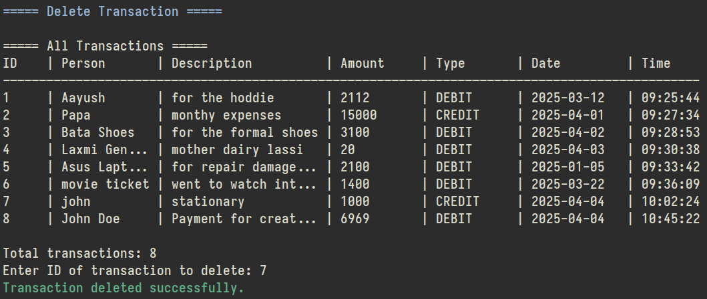
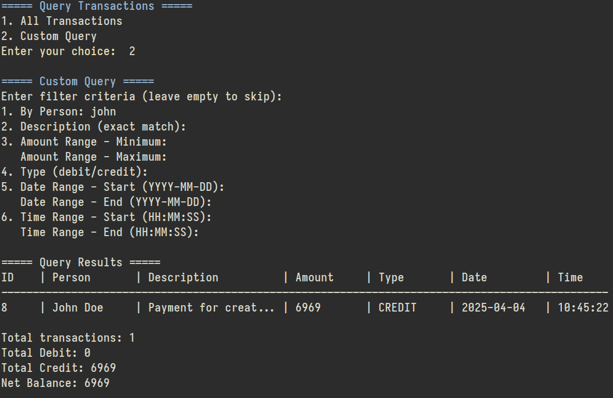

# Okaisa Transaction Manager

Okaisa is a Java-based transaction management system designed to help users track their financial transactions with a simple command-line interface. The application allows for recording, managing, and analyzing both debit and credit transactions.


## Features

- **Transaction Management**: Add, edit, and delete financial transactions
- **Data Persistence**: Transactions are saved to a file and can be loaded in future sessions
- **Detailed Querying**: Filter transactions based on multiple criteria
- **Financial Reporting**: Generate summary reports for various time periods
- **User-Friendly Interface**: Simple terminal-based menu system with color coding

## Screenshots

### Main Menu


### Add Transaction


### Delete Transaction



### Edit Transaction


### Custom Query



### Transaction Summary


## Program Flow

The application follows a straightforward workflow:


1. Load transactions from file
2. Display menu and get user input
3. Execute the user's selected operation
4. Save modified transactions to file
5. Exit when requested

## System Architecture

The application consists of the following key components:

### TransactionManager Class

- Main application class
- Handles the user interface and program flow
- Contains methods for all transaction operations

### Transaction Class

- Represents a single financial transaction
- Contains the following properties:
  - id: Unique identifier
  - person: Who the transaction was with
  - description: Details about the transaction
  - amount: Financial value (BigDecimal for precision)
  - type: DEBIT or CREDIT
  - date: When the transaction occurred
  - time: Time of the transaction

### TransactionType Enum

- DEBIT: Money going out
- CREDIT: Money coming in

### Data Storage

- Transactions stored in a `transactions.dat` file
- Uses Java serialization for data persistence

## Main Menu Options

1. **Add Transaction**: Record a new financial transaction
2. **Delete Transaction**: Remove an existing transaction
3. **Edit Transaction**: Modify details of an existing transaction
4. **Query Transactions**: Search for transactions with various filters
   - All Transactions
   - Custom Query (by person, amount, date, etc.)
5. **Info (Debit/Credit Reports)**: Generate summary reports
   - Today's transactions
   - Weekly transactions (last 7 days)
   - Monthly transactions (current month)
6. **Exit**: Save and quit the application

## Custom Query Filters

The application allows filtering transactions by:

- Person/entity name
- Description
- Amount range (minimum and maximum)
- Transaction type (debit or credit)
- Date range
- Time range

## Installation and Usage

### Prerequisites

- Java Development Kit (JDK) 8 or higher

### Running the Application

1. Compile the Java files:

   ```bash
   javac TransactionManager.java
   ```

2. Run the application:

   ```bash
   java TransactionManager
   ```

### First-time Usage

1. When you first run the application, it will create a new empty transaction database
2. Use the "Add Transaction" option to start recording your financial activities
3. The application will automatically save your data between sessions

## Development Notes

- Uses Java's `BigDecimal` for precise financial calculations
- Implements Java 8 Stream API for efficient data filtering and aggregation
- Uses Java's serialization for data persistence
- Employs ANSI color codes for improved terminal UI readability

## License

This project is licensed under [GNU General Public License v3.0](./LICENSE)

## Contributing

Contributions to Okaisa Transaction Manager are welcome and appreciated. Here's how you can contribute:

### Reporting Issues

- Use the issue tracker to report bugs
- Describe the bug and include specific details to help identify the issue
- Include steps to reproduce the bug
- Add screenshots if applicable

### Feature Requests

- Use the issue tracker to suggest enhancements
- Clearly describe the feature and its expected behavior
- Explain why this feature would be useful to most users

### Pull Requests

1. Fork the repository
2. Create a new branch (`git checkout -b feature/amazing-feature`)
3. Make your changes
4. Commit your changes (`git commit -m 'Add some amazing feature'`)
5. Push to the branch (`git push origin feature/amazing-feature`)
6. Open a Pull Request

### Code Style

- Follow the existing code style
- Add comments to explain complex sections of code
- Update documentation if necessary

### Development Setup

1. Clone the repository
2. Compile using your preferred Java compiler
3. Run tests to ensure everything works correctly

Thank you for considering contributing to this project!

## Contributors

- Name: Deepanshu Choudhary (h4636oh)
- Email: <h4636oh@tuta.io>
- LinkedIn: <https://www.linkedin.com/in/deepanshu-choudhary-4952a4297/>
- Name-Suparna Joshi(Seagle4J)
- Email:sajoshi4104@gmail.com
- LinkedIn: <https://www.linkedin.com/in/suparna-abhijeet-joshi-441a27297/>
